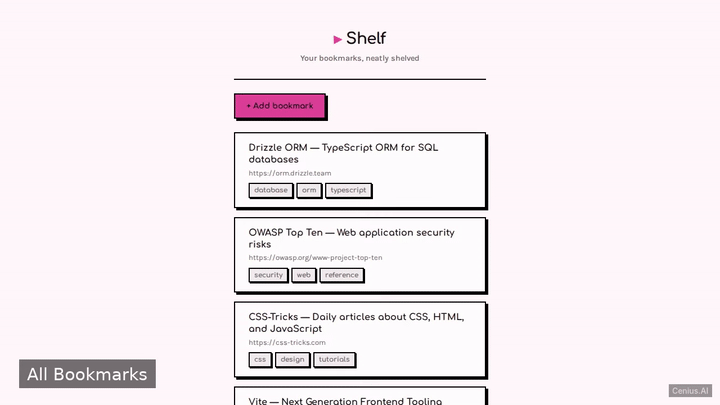
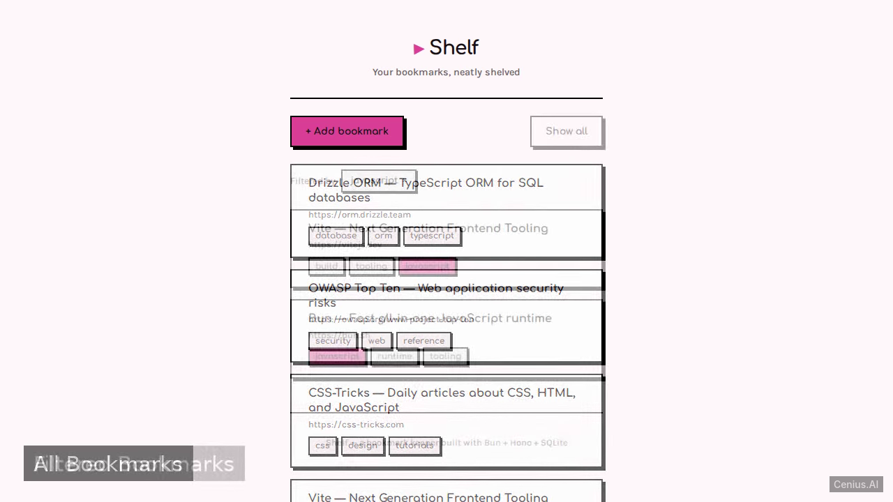
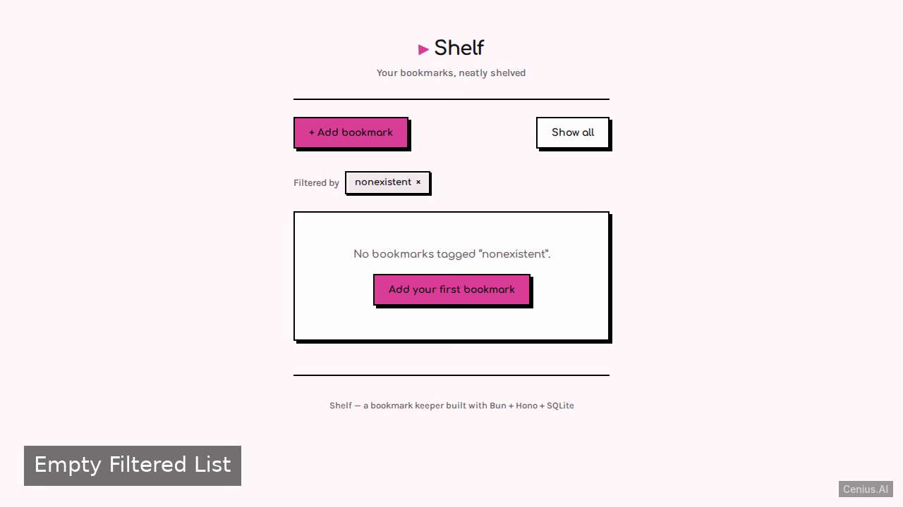

# Bun Bookmarks — Node.js bookmark knowledge base app reference implementation

**Bun Bookmarks** gives you two paths: self-host the Apache-2.0-licensed Node.js source as your own knowledge base app, or [open it on cenius.ai](https://cenius.ai/marketplace/p/bun-bookmarks?ref=gh&utm_campaign=bun-bookmarks-nodejs), describe the changes you want, and receive a new Bun Bookmarks build with full rebrand rights. A lightweight server-rendered bookmarks web application using Bun, Hono, and bun:sqlite. Everything ships in this repo — no paywall, no hidden features, no separate Bun Bookmarks download.


[](LICENSE)  [](https://cenius.ai)

[](https://cenius.ai/marketplace/p/bun-bookmarks?ref=gh&utm_campaign=bun-bookmarks-nodejs)

> **▶ [Open & edit in cenius.ai](https://cenius.ai/marketplace/p/bun-bookmarks?ref=gh&utm_campaign=bun-bookmarks-nodejs)** — one click to an editable workspace: describe changes in plain English, get an instant preview, one-click deploy and host. Modifications made on the platform come with full rebrand & relicense rights.

_Local clone? See [Quick start](#quick-start) below. cenius.ai is the zero-setup path._

## Demo



▶ **[See it in action](https://cenius.ai/marketplace/p/bun-bookmarks?ref=gh&utm_campaign=bun-bookmarks-nodejs)** — full demo on the project page · [MP4](.github/media/demo.mp4)

## Screenshots

  

## Quick start

```bash
./install.sh   # installs dependencies + seeds demo data
```

See [`INSTALL.md`](INSTALL.md) for full setup and usage instructions.

## Usage guide

Once the server is running (see [INSTALL.md](INSTALL.md)), you can use the app through any web browser.

### Browsing Bookmarks

Open `http://localhost:3000` (or the configured `PORT`). The home page displays a list of all bookmarks, sorted by most recently added.

### Adding a Bookmark

Use the “Add Bookmark” form (usually accessible from the main page or at `/add`). Fill in:

- **URL** – the bookmark’s web address
- **Title** – a descriptive label
- **Tags** – comma-separated keywords (e.g., `javascript,runtime,tooling`)

Submit the form to save the bookmark and return to the list.

### Filtering by Tag

Enter a tag in the filter/search input and submit. The page will reload showing only bookmarks whose tags contain the entered keyword.

### Data Storage

All bookmarks are persisted in `data/bookmarks.db`, an SQLite database that is created automatically. Seeding happens only when the table is empty, so your additions will survive restarts.

_Full guide: [`USAGE.md`](USAGE.md)_

## Features

- View bookmark list with tag filter
- Add a new bookmark
- Seed sample bookmarks

## Architecture

Open the repo and you'll find a complete Node.js application (11 files). Top-level layout: `data/`. Run `./install.sh` once to install packages and populate demo data — the app is ready to use immediately after. Step-by-step setup guide: [`INSTALL.md`](INSTALL.md).

## FAQ

### What does it take to self-host Bun Bookmarks?

It runs entirely on your own machine. Clone, run `./install.sh`, and follow [`INSTALL.md`](INSTALL.md) — the whole stack is in this repo, no external dependencies required.

### What technologies are in Bun Bookmarks's stack?

The app is built with Node.js. What you see in this repo is the full production source, demo data included. Highlights include add a new bookmark.

### Is it possible to white-label Bun Bookmarks for a client?

Rebranding is straightforward under the MIT license — change what you want in the source. Or [open it on cenius.ai](https://cenius.ai/marketplace/p/bun-bookmarks?ref=gh&utm_campaign=bun-bookmarks-nodejs): the platform handles the changes and grants full rebrand rights on the result.

### Is Bun Bookmarks free for commercial use?

Yes — it ships under the Apache-2.0 license, which permits commercial use, modification and redistribution. The full text is in [LICENSE](LICENSE).

### Can I change Bun Bookmarks without writing code?

Yes — [load it on cenius.ai](https://cenius.ai/marketplace/p/bun-bookmarks?ref=gh&utm_campaign=bun-bookmarks-nodejs), describe the change in plain English, and you get back a fresh build with your modification applied.

## License & rebranding

Released under the [Apache License 2.0](LICENSE) (© 2026 Cenius AI) — free for personal and commercial use. The Cenius name/logo are trademarks (see NOTICE).

**Need a customized version?** [Remix this app on cenius.ai](https://cenius.ai/marketplace/p/bun-bookmarks?ref=gh&utm_campaign=bun-bookmarks-nodejs) — modifications made on the platform come with **full rebrand & relicense rights** over your derivative.

## Built with cenius.ai

This entire application — code, design, seeded demo data — was generated on **[cenius.ai](https://cenius.ai)** from a plain-English description.

- 🚀 [Build your own app on cenius.ai](https://cenius.ai)
- 🎛️ [Remix Bun Bookmarks on the marketplace](https://cenius.ai/marketplace/p/bun-bookmarks?ref=gh&utm_campaign=bun-bookmarks-nodejs) — open it in a workspace, prompt for changes, and ship your own version.

More open-source apps: [the Cenius-ai catalog](https://github.com/Cenius-ai) · [showcase index](https://github.com/Cenius-ai/showcase)
